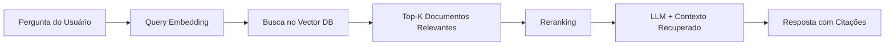

# PRD 01 — RAG-Powered Market Intelligence Chat

## 1. Problema

O chat do AI Market Insight hoje usa apenas o conhecimento geral do LLM para responder perguntas de mercado. Isso causa:

- **Alucinações**: Dados inventados sobre mercados, funding, concorrentes
- **Desatualização**: Conhecimento limitado ao training cutoff do modelo
- **Sem fontes**: Usuário não consegue verificar a veracidade das respostas
- **Zero diferenciação**: Qualquer ChatGPT/Gemini responde igual

> [!CAUTION]
> Sem RAG, o produto é apenas um wrapper de LLM — sem moat competitivo real.

---

## 2. Solução

Implementar **Retrieval-Augmented Generation (RAG)** para que o chat responda baseado em **dados reais de mercado** coletados pelos scripts de execução, reports, e fontes confiáveis.

### Fluxo Proposto



---

## 3. Escopo

### In-Scope (Must Have)
- Pipeline de ingestão: converter outputs dos scripts Python (`.tmp/*.json`) em embeddings
- Vector store no Supabase via `pgvector`
- Retrieval endpoint (Supabase Edge Function)
- Chat frontend com citações/fontes nas respostas
- Chunking inteligente por seção de relatórios

### Should Have
- Hybrid search (semântico + keyword BM25)
- Reranking com MMR (Maximal Marginal Relevance) — gratuito
- Indicador de confiança por resposta (baseado em similarity score)
- Cache de respostas por hash da query (evita chamadas repetidas ao LLM)

### Could Have
- Upload de PDFs pelo usuário (relatórios de mercado)
- Scheduled re-indexing automático

### Out of Scope
- Fine-tuning de modelos de embedding
- Multi-tenancy de knowledge bases por usuário (v2)

---

## 4. Arquitetura Técnica (3 Camadas)

### Layer 1 — Directive
**Novo arquivo**: `directives/rag_pipeline.md`
- Define fluxo de ingestão, formatos aceitos, critérios de chunking
- Regras de quando re-indexar dados
- Thresholds de relevância para incluir/excluir contexto

### Layer 3 — Execution
**Novos scripts**:

| Script | Função |
|--------|--------|
| `execution/rag_ingest.py` | Lê JSONs/textos do `.tmp/`, chunka, gera embeddings, insere no Supabase pgvector |
| `execution/rag_query.py` | Recebe query, busca documentos similares, retorna top-K com scores |

**Dependências** (adicionar ao `requirements.txt`):
```
sentence-transformers   # embeddings locais, gratuito
pgvector                # client pgvector
supabase                # já no stack
tiktoken                # contagem de tokens
```

> [!NOTE]
> Nenhuma nova API paga necessária. Todos os componentes rodam localmente ou usam infra já existente (Supabase).

### Backend — Supabase
- Extensão `pgvector` habilitada
- Tabela `documents`: `id`, `content`, `embedding`, `metadata`, `source`, `chunk_index`, `created_at`
- Função SQL de busca por similaridade (cosine distance)
- Edge Function `rag-search` para expor via API

### Frontend
- Componente `SourceCitation.tsx` para exibir fontes inline
- Badge de confiança (🟢 Alta | 🟡 Média | 🔴 Baixa) baseado em similarity score
- Fallback gracioso quando nenhum documento relevante é encontrado

---

## 5. Stack Zero-Cost

| Componente | Solução | Custo |
|------------|---------|-------|
| **Embeddings** | `bge-small-en-v1.5` (sentence-transformers) — local | $0 |
| **Vector Store** | Supabase pgvector — já no stack | $0 |
| **Reranking** | MMR (Maximal Marginal Relevance) — nativo LangChain | $0 |
| **Cache** | Supabase tabela `query_cache` com hash MD5 | $0 |
| **LLM** | Lovable Gateway — já em uso | Já pago |

**Modelo de embedding escolhido: `bge-small-en-v1.5`**
- Qualidade próxima ao OpenAI ada-002
- 384 dimensões — leve e rápido
- Roda 100% local, sem API externa
- Suporta inglês e português

### Cache de Respostas
Antes de chamar o LLM, verificar se a query (ou similar) já foi respondida:
```python
import hashlib
query_hash = hashlib.md5(query.strip().lower().encode()).hexdigest()
# Busca no Supabase query_cache → retorna se hit
# Salva no cache após nova resposta gerada
```
Reduz chamadas ao LLM em ~30–40% em uso regular.

---

## 6. Métricas de Sucesso

| Métrica | Target | Como Medir |
|---------|--------|------------|
| **Respostas com citações** | >80% das respostas | % de respostas que incluem pelo menos 1 fonte |
| **Relevância do retrieval** | MRR >0.7 | Mean Reciprocal Rank dos documentos recuperados |
| **Redução de alucinações** | -60% | Avaliação manual de amostra (antes vs depois) |
| **Latência** | <3s p95 | Tempo total query → resposta com retrieval |
| **Adoção** | >50% dos chats | % de conversas que disparam retrieval |

---

## 7. Riscos e Mitigações

| Risco | Severidade | Mitigação |
|-------|-----------|-----------|
| Base de dados vazia no início | Alta | Seed automático com outputs dos scripts existentes |
| Latência alta (embedding local) | Média | Cache de embeddings computados, batch processing no ingest |
| Dados desatualizados | Média | Metadata com timestamp, alertar quando dado >30 dias |
| Qualidade dos embeddings locais | Baixa | `bge-small-en-v1.5` tem qualidade suficiente para market intel |

---

## 8. Estimativa RICE

| | Valor |
|---|---|
| **Reach** | 100% dos usuários (chat é feature central) |
| **Impact** | 3x (Massive — transforma a proposta de valor) |
| **Confidence** | 80% (Medium — RAG é padrão comprovado) |
| **Effort** | 3 person-weeks |
| **RICE Score** | **(100 × 3 × 0.8) / 3 = 80** |

---

## 9. Critérios de Aceite

- [ ] Embeddings gerados localmente com `bge-small-en-v1.5` — sem API paga
- [ ] Dados dos scripts `competitor_discovery.py` e `framework_analysis.py` indexados no vector store
- [ ] Cache de respostas funcional (hit retorna sem chamar o LLM)
- [ ] Chat retorna respostas com pelo menos 1 citação quando dados relevantes existem
- [ ] Fallback graciosa para resposta sem RAG quando similarity score < threshold
- [ ] Latência total < 3s para 95% das queries
- [ ] Badge de confiança visível no frontend
- [ ] Custo adicional de infra: **$0**
