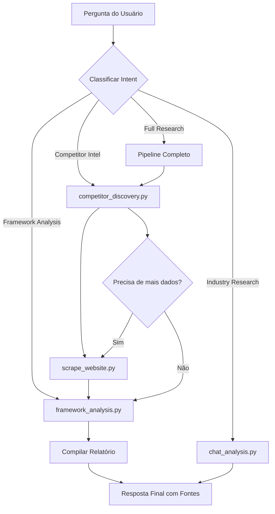
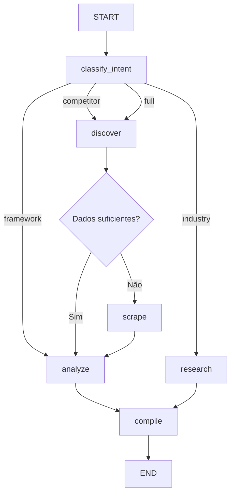

# PRD 02 — LangGraph Market Research Agent

## 1. Problema

Hoje os scripts de execução (`competitor_discovery.py`, `framework_analysis.py`, `chat_analysis.py`) são ferramentas isoladas. O usuário precisa:

1. Executar cada script manualmente ou pedir ao AI
2. Decidir qual script usar e em qual ordem
3. Combinar resultados de diferentes scripts manualmente
4. Não há fluxo automatizado de "pesquisa → análise → relatório"

> [!IMPORTANT]
> A arquitetura de 3 camadas define que a **Camada 2 (Orquestração)** é o AI fazendo routing inteligente. Hoje essa camada não existe como código — é improvisada a cada conversa.

---

## 2. Solução

Implementar um **agente orquestrador com LangGraph** que conecta os scripts de execução num fluxo inteligente e automatizado.

### Fluxo do Agente



---

## 3. Escopo

### In-Scope (Must Have)
- Agent graph com LangGraph usando os scripts existentes como tools
- State management com histórico de análises realizadas
- Routing condicional baseado no tipo de pergunta
- Pipeline completo: discovery → scraping → framework → relatório
- Integração com Supabase Edge Function para o frontend

### Should Have
- Human-in-the-loop: pausar para confirmação antes de operações custosas
- Checkpointing (salvar estado para retomar análise)
- Streaming de progresso para o frontend (etapa atual, % concluído)

### Could Have
- Multi-agent: agentes especializados por domínio (fintech, saúde, etc.)
- Loop de auto-correção (re-execute se resultado for fraco)

### Out of Scope
- Execução paralela de múltiplos agents
- Agent memory de longo prazo entre sessões (v2)

---

## 4. Arquitetura Técnica (3 Camadas)

### Layer 1 — Directive
**Novo arquivo**: `directives/agent_orchestrator.md`
- Define regras de routing (quando usar qual script)
- Limites de execução (max steps, timeout, budget por query)
- Critérios para human-in-the-loop

### Layer 3 — Execution
**Novo script principal**: `execution/agent_orchestrator.py`

```python
# Estrutura conceitual do grafo
class ResearchState(TypedDict):
    messages: Annotated[list, add_messages]
    query: str
    intent: str  # "competitor", "framework", "industry", "full"
    competitors: list[dict]  # Output do competitor_discovery
    scraped_data: list[dict]  # Output do scraping
    analysis: dict  # Output do framework_analysis
    report: str  # Relatório final compilado
    step: str  # Etapa atual para streaming
```

**Tools do agente** (wrappers dos scripts existentes):

| Tool | Script Base | Função |
|------|-------------|--------|
| `discover_competitors` | `competitor_discovery.py` | Descobre competidores |
| `scrape_competitor` | Novo (usa directive `scrape_website.md`) | Scrapa site de competidor |
| `run_framework` | `framework_analysis.py` | Executa SWOT/Porter/BCG |
| `research_industry` | `chat_analysis.py` | Pesquisa de mercado geral |
| `compile_report` | Novo | Compila resultados em relatório final |

### Backend — Supabase
- Edge Function `agent-run` que invoca o agente e faz streaming
- Tabela `agent_runs`: `id`, `user_id`, `query`, `state`, `status`, `result`, `created_at`
- Persistência de execuções para histórico

### Frontend
- Componente `AgentProgress.tsx`: barra de progresso com etapas
- Modo "Full Research" no chat: botão para análise completa
- Timeline de resultados intermediários (competidores encontrados → dados coletados → análise)

---

## 5. Graph Definition



---

## 6. Métricas de Sucesso

| Métrica | Target | Como Medir |
|---------|--------|------------|
| **Automação end-to-end** | >70% das pesquisas sem intervenção manual | % de runs que completam sem human-in-the-loop |
| **Tempo de pesquisa completa** | <5 min (vs ~30min manual) | Tempo médio start → relatório final |
| **Qualidade do routing** | >90% intent correto | Avaliação manual de amostra |
| **Completude do relatório** | >85% seções preenchidas | % de campos não-vazios no output |
| **Reuso de tools** | >3 tools/run em média | Média de tools invocados por execução |

---

## 7. Riscos e Mitigações

| Risco | Severidade | Mitigação |
|-------|-----------|-----------|
| Loops infinitos no grafo | Alta | Max steps = 10, timeout = 5min |
| Custo alto de API por run | Alta | Budget cap por query, human-in-the-loop para operações custosas |
| Falha em um step quebra toda a pipeline | Média | Error handling por node, fallback para resultado parcial |
| Latência total alta (múltiplas API calls) | Média | Streaming de resultados intermediários, cache |

---

## 8. Estimativa RICE

| | Valor |
|---|---|
| **Reach** | 80% dos usuários (quem usa pesquisa) |
| **Impact** | 3x (Massive — cria fluxo inteligente automatizado) |
| **Confidence** | 60% (Low-Medium — complexidade alta de integração) |
| **Effort** | 5 person-weeks |
| **RICE Score** | **(80 × 3 × 0.6) / 5 = 28.8** |

---

## 9. Critérios de Aceite

- [ ] Agente classifica corretamente o intent em >90% dos casos de teste
- [ ] Pipeline "Full Research" executa discovery → scrape → framework → relatório sem erros
- [ ] Streaming de progresso funciona no frontend (etapa atual visível)
- [ ] Timeout de 5 minutos impede loops infinitos
- [ ] Resultados parciais são entregues mesmo se um step falhar
- [ ] Histórico de runs salvo no Supabase e acessível ao usuário
