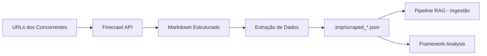

# PRD 03 — Firecrawl Web Scraping Engine

## 1. Problema

A directive `scrape_website.md` existe mas **não tem script de execução implementado**. Hoje:

- Scraping depende do LLM fazer manualmente (não-determinístico)
- Sem extração estruturada de dados de sites de concorrentes
- Sites com JavaScript rendering não são acessíveis
- Nenhum pipeline de batch scraping para múltiplas URLs
- Dados de pricing, features, team size ficam desatualizados

> [!WARNING]
> O `competitor_discovery.py` descobre concorrentes mas não coleta dados reais dos seus sites — tudo vem do LLM.

---

## 2. Solução

Implementar **scraping robusto com Firecrawl API** — extração de conteúdo web com JS rendering, conversão para Markdown, e integração direta com o pipeline RAG.

### Fluxo



---

## 3. Escopo

### In-Scope (Must Have)
- Script `execution/scrape_website.py` usando Firecrawl API
- Extração de: pricing, features, about, team, blog posts
- Conversão para Markdown limpo (sem noise)
- Output em JSON estruturado no `.tmp/`
- Batch scraping de múltiplas URLs

### Should Have
- Scheduled crawling (re-scrape a cada X dias)
- Detecção de mudanças (diff entre scrapes)
- Screenshot automático do site

### Could Have
- PDF parsing de relatórios de mercado
- Sitemap crawling completo
- Extração de dados de pricing tables

### Out of Scope
- Bypass de CAPTCHAs ou anti-bot
- Scraping de dados behind login/paywall

---

## 4. Arquitetura Técnica (3 Camadas)

### Layer 1 — Directive
**Atualizar**: `directives/scrape_website.md`
- Adicionar Firecrawl como ferramenta padrão
- Definir páginas-alvo por tipo (pricing, about, blog)
- Regras de rate limiting e politeness
- Schema de output esperado

### Layer 3 — Execution
**Novo script**: `execution/scrape_website.py`

```python
# API principal
def scrape_single(url: str, formats: list = ["markdown"]) -> dict:
    """Scrape uma única URL e retorna conteúdo estruturado."""

def scrape_batch(urls: list[str]) -> list[dict]:
    """Scrape múltiplas URLs em batch."""

def extract_competitor_data(scraped: dict) -> dict:
    """Extrai dados estruturados (pricing, features, etc.) do markdown."""

def crawl_site(url: str, max_pages: int = 10) -> list[dict]:
    """Crawl completo de um site com limite de páginas."""
```

**Dependências** (adicionar ao `requirements.txt`):
```
firecrawl-py
```

**Variável de ambiente** (adicionar ao `.env`):
```
FIRECRAWL_API_KEY=fc-...
```

### Integração com RAG
- Output salvo em `.tmp/scraped_*.json`
- `rag_ingest.py` (PRD 01) processa automaticamente novos scrapes
- Metadata inclui: URL de origem, data do scrape, tipo de página

---

## 5. Output Schema

```json
{
  "url": "https://competitor.com/pricing",
  "scraped_at": "2026-02-24T15:00:00Z",
  "page_type": "pricing",
  "markdown": "# Pricing Plans\n\n## Starter - $29/mo\n...",
  "extracted": {
    "pricing_plans": [
      {"name": "Starter", "price": "$29/mo", "features": ["..."]}
    ],
    "company_name": "Competitor Inc",
    "last_updated": "2026-02-20"
  },
  "screenshot_url": null,
  "metadata": {
    "status_code": 200,
    "word_count": 1250,
    "links_found": 45
  }
}
```

---

## 6. Métricas de Sucesso

| Métrica | Target | Como Medir |
|---------|--------|------------|
| **Taxa de sucesso de scrape** | >90% | URLs com status 200 / total |
| **Dados extraídos por competidor** | >4 campos | Campos não-nulos no output |
| **Freshness** | <7 dias | Idade média dos dados scrapeados |
| **Integração RAG** | 100% indexados | Scrapes disponíveis no vector store |
| **Custo por scrape** | <$0.01/página | Custo Firecrawl API / páginas |

---

## 7. Estimativa RICE

| | Valor |
|---|---|
| **Reach** | 60% dos usuários (quem faz competitive intel) |
| **Impact** | 2x (High — dados reais vs dados do LLM) |
| **Confidence** | 90% (High — Firecrawl é ferramenta madura) |
| **Effort** | 1.5 person-weeks |
| **RICE Score** | **(60 × 2 × 0.9) / 1.5 = 72** |

---

## 8. Critérios de Aceite

- [ ] Script scrapa com sucesso >90% das URLs de teste (10 sites de SaaS populares)
- [ ] Output em JSON estruturado com markdown limpo (sem HTML/scripts)
- [ ] Batch scraping de 5+ URLs funciona sem rate limiting
- [ ] Dados scrapeados são automaticamente indexados no RAG (quando PRD 01 implementado)
- [ ] Variável `FIRECRAWL_API_KEY` documentada no `.env.example`
- [ ] Directive `scrape_website.md` atualizada com novo fluxo
