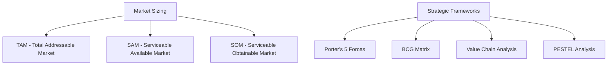

# PRD 04 — Market Sizing & Advanced Frameworks

## 1. Problema

O sistema hoje tem apenas **SWOT analysis** no `framework_analysis.py`. Para um produto de inteligência de mercado, faltam frameworks críticos:

- **Sem TAM/SAM/SOM**: Não calcula tamanho de mercado
- **Sem Porter's 5 Forces**: Sem análise de forças competitivas
- **Sem BCG Matrix**: Sem posicionamento de portfólio
- **Sem Value Chain**: Sem análise de cadeia de valor
- **Sem dados quantitativos**: Tudo é qualitativo hoje

> [!IMPORTANT]
> Market sizing é a feature mais requisitada por investidores e founders. Um produto de „market insight" sem isso tem um gap fundamental.

---

## 2. Solução

Expandir os frameworks disponíveis com **calculadoras quantitativas de mercado** e **frameworks estratégicos adicionais**, seguindo a arquitetura de 3 camadas.

### Novos Frameworks



---

## 3. Escopo

### In-Scope (Must Have)
- **TAM/SAM/SOM Calculator** com 3 metodologias (top-down, bottom-up, value theory)
- **Porter's Five Forces** como novo framework no `framework_analysis.py`
- **BCG Matrix** com posicionamento de produtos/unidades
- Nova página no frontend: `MarketSizing.tsx`
- Visualizações: gráfico de funnel TAM→SAM→SOM, radar chart para Porter

### Should Have
- **PESTEL Analysis** (Political, Economic, Social, Tech, Environmental, Legal)
- **Value Chain Analysis** (atividades primárias e de suporte)
- Comparação lado a lado de múltiplos mercados

### Could Have
- Integração com dados de mercado de APIs públicas (Statista, World Bank)
- Template de pitch deck com dados calculados
- Export para Google Slides

### Out of Scope
- Financial modeling (burn rate, runway, etc.) — será outro PRD
- Dados proprietários de mercado (requer licenças)

---

## 4. Arquitetura Técnica (3 Camadas)

### Layer 1 — Directives
**Novo arquivo**: `directives/market_sizing.md`
- Define metodologias aceitas (top-down, bottom-up, value theory)
- Regras de validação (TAM > SAM > SOM)
- Fontes de dados aceitáveis
- Template de output

**Atualizar**: `directives/framework_analysis.md`
- Adicionar Porter's 5 Forces, BCG, PESTEL
- Definir quando usar cada framework

### Layer 3 — Execution
**Novo script**: `execution/market_sizing.py`

```python
def calculate_tam(
    industry_revenue: float,      # Receita total da indústria
    growth_rate: float,           # CAGR%
    methodology: str = "top_down" # top_down | bottom_up | value_theory
) -> dict:
    """Calcula TAM usando a metodologia escolhida."""

def calculate_sam(
    tam: float,
    geographic_filter: float,    # % do TAM na região
    segment_filter: float,       # % do TAM no segmento
    capability_filter: float     # % acessível com produto atual
) -> dict:
    """Calcula SAM a partir do TAM com filtros."""

def calculate_som(
    sam: float,
    market_share_target: float,  # % realista em 3-5 anos
    competitive_factor: float    # Fator competitivo (0-1)
) -> dict:
    """Calcula SOM realista."""

def full_market_sizing(inputs: dict) -> dict:
    """Pipeline completo TAM→SAM→SOM com validação."""
```

**Atualizar**: `execution/framework_analysis.py`
- Adicionar `framework="porter"` → Porter's Five Forces
- Adicionar `framework="bcg"` → BCG Matrix
- Adicionar `framework="pestel"` → PESTEL Analysis

### Frontend

**Nova página**: `src/pages/MarketSizing.tsx`
- Formulário de inputs (indústria, região, pricing, # customers)
- Visualização funnel: TAM → SAM → SOM com valores e %
- Gráfico de barras de crescimento (CAGR projetado)
- Card com methodology breakdown

**Atualizar**: `src/pages/Frameworks.tsx`
- Adicionar seletor para novos frameworks (Porter, BCG, PESTEL)
- Radar chart para Porter's 5 Forces (5 eixos)
- Matrix 2x2 interativa para BCG

### Navegação
- Adicionar rota `/market-sizing` no router
- Adicionar item na sidebar/bottom tabs

---

## 5. TAM/SAM/SOM Output Schema

```json
{
  "market": "AI-powered market intelligence tools",
  "methodology": "bottom_up",
  "tam": {
    "value_usd": 15000000000,
    "calculation": "150K companies × $100K avg contract",
    "sources": ["Gartner 2025", "IDC Forecast"],
    "confidence": "medium"
  },
  "sam": {
    "value_usd": 2250000000,
    "filters_applied": {
      "geographic": "North America (45%)",
      "segment": "Mid-market 100-1000 employees (33%)"
    },
    "confidence": "medium"
  },
  "som": {
    "value_usd": 45000000,
    "market_share": "2%",
    "timeline": "3 years",
    "confidence": "low"
  },
  "growth": {
    "cagr": 24.5,
    "projection_years": 5
  },
  "timestamp": "2026-02-24T15:00:00Z"
}
```

---

## 6. Métricas de Sucesso

| Métrica | Target | Como Medir |
|---------|--------|------------|
| **Frameworks disponíveis** | ≥5 (SWOT, Porter, BCG, PESTEL, TAM/SAM/SOM) | Contagem |
| **Market sizing completo** | <60s de execução | Tempo input → output |
| **Validação de dados** | 100% TAM>SAM>SOM | Assertions automáticas |
| **Adoção da página** | >30% dos usuários | Analytics de pageview |
| **Precisão percebida** | >4/5 rating | Feedback do usuário |

---

## 7. Estimativa RICE

| | Valor |
|---|---|
| **Reach** | 90% dos usuários (core feature) |
| **Impact** | 2x (High — preenche gap fundamental) |
| **Confidence** | 90% (High — frameworks são bem definidos) |
| **Effort** | 3 person-weeks |
| **RICE Score** | **(90 × 2 × 0.9) / 3 = 54** |

---

## 8. Critérios de Aceite

- [ ] TAM/SAM/SOM calculado com pelo menos 2 metodologias (top-down e bottom-up)
- [ ] Validação automática: TAM ≥ SAM ≥ SOM (rejeita inputs inválidos)
- [ ] Porter's 5 Forces e BCG Matrix funcionam no `framework_analysis.py`
- [ ] Página `MarketSizing.tsx` com formulário e visualização funnel
- [ ] Novos frameworks aparecem no seletor da página Frameworks
- [ ] Radar chart para Porter e matrix 2×2 para BCG renderizam corretamente
- [ ] Output salvo em `.tmp/` e reutilizável pelo agente (PRD 02)
