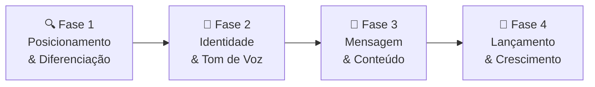
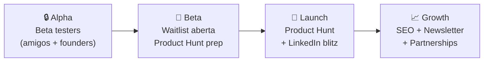

# 🧠 Brainstorming: Estratégia de Branding — AI Market Insight

> Documento gerado seguindo a metodologia da skill **brainstorming** — transformando ideias em designs validados antes de qualquer implementação.

---

## 📋 Understanding Summary

- **O que estamos construindo:** Estratégia de branding para o **AI Market Insight** — plataforma de inteligência de mercado e análise competitiva powered by AI
- **Por que existe:** Para posicionar o AI Market Insight como ferramenta premium de market intelligence, diferenciando-o de "wrappers de LLM" genéricos
- **Para quem é:** Founders, investidores e equipes de estratégia que precisam de dados de mercado confiáveis (TAM/SAM/SOM, SWOT, Porter, concorrentes)
- **Produto core:** Chat RAG com citações reais, scraping inteligente (Firecrawl), frameworks estratégicos (SWOT, Porter, BCG, PESTEL), market sizing quantitativo
- **Diferencial:** Respostas baseadas em dados reais (não alucinações), arquitetura 3 camadas auto-corretiva, zero-cost stack
- **Não-objetivo:** Não estamos redesenhando o produto — foco em como comunicar, posicionar e distribuir a marca

---

## 🏆 Top 10 Skills para o Branding do AI Market Insight

| # | Skill | Relevância | Como se aplica ao AI Market Insight |
|---|-------|------------|-------------------------------------|
| 1 | `copywriting` | ⭐⭐⭐⭐⭐ | Copy da homepage, landing pages, messaging do produto |
| 2 | `competitive-landscape` | ⭐⭐⭐⭐⭐ | Irônico: usar análise competitiva para posicionar **o próprio** produto de análise competitiva |
| 3 | `marketing-psychology` | ⭐⭐⭐⭐⭐ | Vieses psicológicos para posicionar "dados reais vs alucinação" |
| 4 | `content-creator` | ⭐⭐⭐⭐⭐ | Definir tom de voz: técnico mas acessível, data-driven |
| 5 | `social-content` | ⭐⭐⭐⭐ | LinkedIn e Twitter/X são os canais da audiência target |
| 6 | `content-marketer` | ⭐⭐⭐⭐ | Estratégia de SEO e thought leadership em market intelligence |
| 7 | `launch-strategy` | ⭐⭐⭐⭐ | Framework ORB para lançar features (RAG, Market Sizing) |
| 8 | `pricing-strategy` | ⭐⭐⭐⭐ | Definir modelo de monetização (freemium? usage-based?) |
| 9 | `marketing-ideas` | ⭐⭐⭐ | Priorizar canais de crescimento com MFS Score |
| 10 | `brand-guidelines-community` | ⭐⭐⭐ | Criar identidade visual coerente |

---

## 🗺️ Mapa Estratégico: 4 Fases do Branding para AI Market Insight



---

## 🔍 Fase 1 — Posicionamento & Diferenciação

> **Pergunta central:** Como o AI Market Insight se diferencia de ChatGPT, Gemini, e outras ferramentas de IA genéricas?

### Skills utilizadas
- `competitive-landscape` — Mapear concorrentes diretos e indiretos
- `marketing-psychology` — Modelos mentais para o posicionamento

### Concorrentes a mapear

| Tipo | Exemplos | Ameaça |
|------|----------|--------|
| **Wrappers de LLM genéricos** | ChatGPT, Gemini, Perplexity | Alta — são "bons o suficiente" para muitos |
| **Ferramentas de market intel** | CB Insights, Crunchbase, PitchBook | Média — preço alto, mas dados proprietários |
| **Frameworks de pesquisa** | SparkToro, SimilarWeb, SEMrush | Baixa — foco diferente |

### Posicionamento proposto

```
"O ChatGPT inventa dados de mercado.
 O AI Market Insight cita as fontes."
```

**Modelos mentais mais relevantes (PLFS):**

| Modelo | Comportamento-alvo | PLFS |
|--------|-------------------|------|
| **Authority Bias** | Mostrar dados com citações = percepção de autoridade | +13 |
| **Loss Aversion** | "Decisão baseada em alucinação pode custar $$$" | +12 |
| **Social Proof** | Cases de uso + depoimentos de founders/investidores | +11 |
| **Framing Effect** | Enquadrar como "inteligência" vs "chat" | +10 |

### 💬 Prompt adaptado para `competitive-landscape`:

```
Use a skill competitive-landscape.

Produto: AI Market Insight — plataforma de inteligência de mercado 
powered by AI com RAG (dados reais com citações), scraping 
inteligente, e frameworks estratégicos (SWOT, Porter, BCG, 
TAM/SAM/SOM).

Concorrentes diretos: ChatGPT/Gemini (wrappers genéricos), 
CB Insights, Crunchbase, PitchBook, SparkToro.

Objetivo: Identificar gaps de posicionamento onde AI Market Insight
pode vencer. Foco no ângulo "dados reais com fontes vs alucinação".

Aplique Porter's Five Forces ao mercado de market intelligence 
tools e identifique o quadrante de posicionamento ideal.
```

### 💬 Prompt adaptado para `marketing-psychology`:

```
Use a skill marketing-psychology.

Produto: AI Market Insight (plataforma de market intelligence com IA)
Comportamento-alvo: Convencer founders e investidores a CONFIAR 
nas respostas do chat de mercado (em vez de usar ChatGPT/Gemini).

Fase da jornada: Consideration → Decision

O diferencial é RAG (respostas com citações de fontes reais), 
enquanto concorrentes genéricos alucinam dados de mercado.

Pontuie os modelos mentais mais relevantes com PLFS, focando em:
- Authority Bias (citações como prova)
- Loss Aversion (risco de decidir com dados inventados)  
- Social Proof (quem já usa)
- Framing Effect ("inteligência de mercado" vs "chatbot")

Máximo 4 modelos. Inclua guardrails éticas.
```

---

## 🎨 Fase 2 — Identidade & Tom de Voz

> **Pergunta central:** Como o AI Market Insight deve *soar* e *parecer*?

### Skills utilizadas
- `content-creator` — Brand voice analyzer e definição de tom
- `brand-guidelines-community` — Sistema visual

### Tom de voz proposto

| Atributo | ✅ AI Market Insight | ❌ Não é isso |
|----------|---------------------|---------------|
| **Confiante** | "Dados de mercado com fontes verificáveis" | "Talvez isso possa ajudar..." |
| **Data-driven** | "TAM de $15B baseado em Gartner 2025" | "O mercado é enorme!" |
| **Direto** | "3 concorrentes com esses diferenciais:" | "Existem diversas empresas no espaço..." |
| **Técnico mas acessível** | Explica Porter sem jargão desnecessário | Nem dumbing-down nem paper acadêmico |
| **Anti-hype** | "Baseado em dados reais" | "Revolucionário! Disruptivo! Game-changer!" |

### Personalidade de marca

```
Arquétipo primário:  O Sábio (The Sage)
Arquétipo secundário: O Criador (The Creator)

→ "Nós não chutamos dados de mercado. Nós encontramos."
```

### 💬 Prompt adaptado para `content-creator`:

```
Use a skill content-creator.

Quero estabelecer o tom de voz do AI Market Insight.

Produto: Plataforma de inteligência de mercado com IA. 
Features: chat RAG com citações, análise de concorrentes, 
frameworks (SWOT, Porter, BCG), market sizing (TAM/SAM/SOM).

Público-alvo: Founders de startups, investidores (VCs/angels), 
equipes de estratégia em empresas mid-market.

Marcas de referência no tom:
- Stripe (clareza técnica)
- Notion (acessível + poderoso)  
- Linear (direto, sem bullshit)

Atributos de tom: confiante, data-driven, direto, anti-hype, 
técnico mas acessível.

Crie 3 amostras de texto:
1. Post LinkedIn anunciando a feature de RAG Chat com citações
2. Email de boas-vindas para novo usuário
3. Headline principal da homepage
```

---

## 📝 Fase 3 — Mensagem & Conteúdo

> **Pergunta central:** Qual é a promessa do AI Market Insight em uma frase?

### Skills utilizadas
- `copywriting` — Copy da homepage e landing pages
- `content-marketer` — Estratégia de conteúdo e SEO

### Value Proposition Canvas

| Elemento | AI Market Insight |
|----------|-------------------|
| **Job-to-be-done** | Tomar decisões de mercado baseadas em dados confiáveis |
| **Pain** | LLMs genéricos inventam dados; reports tradicionais custam $$$ e demoram |
| **Gain** | Respostas instantâneas com fontes, frameworks prontos, sizing quantitativo |
| **Feature → Benefit → Outcome** | RAG Chat → Respostas com citações reais → Decisões de investimento mais seguras |

### Headlines candidatas

| # | Headline | Ângulo |
|---|----------|--------|
| 1 | "Market Intelligence que cita as fontes" | Confiança / Anti-alucinação |
| 2 | "Pare de chutar TAM. Calcule." | Quantitativo / Direto |
| 3 | "O CB Insights de $0/mês" | Comparação / Preço |
| 4 | "Dados de mercado reais. Não alucinações de IA." | Diferenciação / Honestidade |

### 💬 Prompt adaptado para `copywriting`:

```
Use a skill copywriting.

Tipo de página: Homepage
CTA principal: "Comece grátis" ou "Explore agora"

Público-alvo: Founders de startups e investidores que precisam 
de dados de mercado para tomar decisões (pitch decks, due 
diligence, Go-to-Market).

Problema que resolve: LLMs genéricos (ChatGPT, Gemini) inventam 
dados de mercado. Reports tradicionais (CB Insights, PitchBook) 
custam milhares de dólares e levam semanas.

Diferencial: RAG-powered chat com citações de fontes reais, 
frameworks prontos (SWOT, Porter, TAM/SAM/SOM), scraping 
inteligente, zero-cost. Respostas com badge de confiança 
(🟢 Alta | 🟡 Média | 🔴 Baixa).

Nível de awareness: Solution-aware (sabem que precisam de dados 
de mercado, mas usam ChatGPT ou fazem manualmente)

Fonte de tráfego: Orgânico (SEO) + LinkedIn + Product Hunt

Siga o processo completo com Copy Brief → Confirmação → Copy 
por seção → 3 alternativas de headline e CTA.
```

### 💬 Prompt adaptado para `content-marketer`:

```
Use a skill content-marketer.

Produto: AI Market Insight — plataforma de market intelligence 
com IA para founders, investidores e estrategistas.

Objetivo: Criar estratégia de content marketing para posicionar
o AI Market Insight como autoridade em market intelligence.

ICP: Founders de startups (Seed → Series A), VCs, equipes de 
estratégia. No Brasil e globalmente.

Pilares de conteúdo propostos:
1. "Market Intelligence 101" — educar sobre frameworks (SWOT, 
   Porter, TAM/SAM/SOM)
2. "AI vs Alucinação" — comparações entre IA genérica e dados 
   reais
3. "Behind the Build" — como estamos construindo o produto 
   (atrair early adopters)
4. "Market Snapshots" — análises rápidas de mercados usando 
   o próprio produto como showcase

Inclua: calendário editorial mensal, keywords target, 
plano de distribuição (LinkedIn + Blog + Newsletter).
```

---

## 📣 Fase 4 — Lançamento & Crescimento

> **Pergunta central:** Como levar o AI Market Insight ao mercado com momentum?

### Skills utilizadas
- `launch-strategy` — Framework ORB para lançamento faseado
- `social-content` — Conteúdo por plataforma
- `marketing-ideas` — Priorização de canais
- `pricing-strategy` — Modelo de monetização

### ORB Framework aplicado ao AI Market Insight

| Canal | Tipo | Ação concreta |
|-------|------|---------------|
| **Blog / Newsletter** | 🟢 Owned | Publicar "Market Snapshots" semanais usando outputs do próprio produto |
| **Newsletter de founders** | 🟢 Owned | Email semanal com um "market insight" gerado pela plataforma |
| **LinkedIn** | 🟡 Rented | Posts mostrando outputs reais (ex: TAM/SAM/SOM de um mercado trending) |
| **Twitter/X** | 🟡 Rented | Threads técnicos sobre como RAG elimina alucinações |
| **Product Hunt** | 🟡 Rented | Launch prioritário para cada feature major |
| **Podcasts de startup** | 🔵 Borrowed | Participar como "the data guy" com insights gerados pelo produto |
| **Newsletters de VC** | 🔵 Borrowed | Oferecer análises de mercado gratuitas geradas pelo produto |

### Fases de lançamento



### 💬 Prompt adaptado para `launch-strategy`:

```
Use a skill launch-strategy.

Produto: AI Market Insight — plataforma de market intelligence 
com IA. Features: RAG Chat com citações, análise de concorrentes, 
frameworks (SWOT, Porter, BCG, TAM/SAM/SOM), scraping Firecrawl.

Audiência atual: [Defina tamanho da lista de email / seguidores]
Canais owned: Blog (em construção), possível newsletter
Timeline: [Defina data-alvo]

Aplique framework ORB:
- Owned: Newsletter semanal "Market Snapshot"
- Rented: LinkedIn (founders), Twitter/X (tech), Product Hunt
- Borrowed: Podcasts de startup, newsletters de VCs

Proponha:
1. Sequência de 5 fases (Internal → Alpha → Beta → EA → Full)
2. Estratégia Product Hunt específica
3. Checklist completa de pré e pós-lançamento
4. Como usar os outputs do próprio produto como marketing material
```

### 💬 Prompt adaptado para `pricing-strategy`:

```
Use a skill pricing-strategy.

Produto: AI Market Insight
Tipo: SaaS / ferramenta de IA
Target: Founders (SMB), investidores, equipes de estratégia
GTM: Self-serve (plano futuro: sales-led para enterprise)

Concorrentes e preços:
- ChatGPT Plus: $20/mês (genérico, sem market intel específico)
- CB Insights: $29K+/ano (enterprise, dados proprietários)
- Crunchbase Pro: $49/mês (dados de empresas/funding)
- Statista: $59/mês+ (dados de mercado)

Value metric proposto: Número de queries/análises por mês

Objetivo: Maximizar adoção early-stage mantendo caminho 
para monetização. Stack é zero-cost, margem é alta.

Avalie: Freemium vs Free Trial vs Reverse Trial.
Proponha tiers Good/Better/Best com rationale.
```

---

## ⚡ Combos Poderosos para AI Market Insight

### 🔗 Combo 1: "Eat Your Own Dog Food"
```
competitive-landscape → marketing-psychology → copywriting
```
Use o **próprio AI Market Insight** para analisar seus concorrentes → Aplique psicologia para posicionar → Escreva copy matadora.

> **Meta-estratégia:** Cada output do produto é material de marketing. O próprio produto prova seu valor.

### 🔗 Combo 2: "Content Machine"
```
content-creator → content-marketer → social-content
```
Defina tom data-driven → Crie "Market Snapshots" semanais → Distribua no LinkedIn com dados reais.

### 🔗 Combo 3: "Launch Rocket"
```
pricing-strategy → launch-strategy → marketing-ideas → social-content
```
Defina modelo freemium → Planeje lançamento por fases → Priorize os 5 canais com maior MFS → Execute.

---

## 💡 Ideia Única: "Ship the Output as Marketing"

O AI Market Insight tem uma vantagem rara: **o output do produto É o conteúdo de marketing**.

| O que o produto gera | Como vira marketing |
|----------------------|---------------------|
| Análise TAM/SAM/SOM de um mercado | Post LinkedIn: "O mercado de X vale $15B" |
| Relatório SWOT de uma empresa trending | Thread Twitter: "SWOT da empresa Y em 60 segundos" |
| Discovery de concorrentes em um setor | Blog: "Os 8 players de [nicho] que você precisa conhecer" |
| Chat RAG com citações | Screenshot: "Perguntei e ele respondeu COM FONTES" |

Isso cria um **flywheel**:
```
Produto gera insight → Insight vira conteúdo → Conteúdo atrai novos 
usuários → Novos usuários geram mais dados → Produto fica mais inteligente
```

---

## 📌 Decision Log

| # | Decisão | Alternativas | Razão |
|---|---------|-------------|-------|
| 1 | Posicionar como "anti-alucinação" | Posicionar como "mais barato que CB Insights" | Anti-alucinação é mais emocional e único; preço é corrida para o fundo |
| 2 | Tom "data-driven, direto, anti-hype" | Tom corporativo / Tom casual demais | Público de founders/VCs valoriza dados e é alérgico a hype vazio |
| 3 | Arquétipo "O Sábio" | "O Herói" / "O Criador" | Sábio = confiança em dados e conhecimento. Perfeito para market intel |
| 4 | LinkedIn + Twitter como canais primários | Instagram / TikTok | Audiência target (founders, VCs) mora no LinkedIn e Twitter/X |
| 5 | "Ship output as marketing" | Criar conteúdo separado do produto | Reduz esforço e prova o valor do produto simultaneamente |
| 6 | Freemium como modelo base | Free trial / Apenas pago | Zero-cost stack permite margens altas; freemium maximiza adoção |

---

## 📎 Assumptions

- O AI Market Insight está em fase de construção/pré-launch
- O público primário são founders de startups e investidores
- O diferencial técnico (RAG + citações) é funcional ou estará em breve (PRD 01)
- A plataforma terá capacidade de gerar outputs exportáveis (JSON, visuais)
- O mercado de "AI-powered market intelligence" está crescendo rapidamente
- A audiência target consome conteúdo primariamente no LinkedIn e Twitter/X

---

## 🔗 Referências do Projeto

| Arquivo | Relevância para Branding |
|---------|-------------------------|
| [README.md](file:///c:/Github/ai-market-insight/README.md) | Visão geral do produto e arquitetura |
| [Gemini.md](file:///c:/Github/ai-market-insight/Gemini.md) | Filosofia de 3 camadas (diferencial comunicável) |
| [PRD_01_RAG_Chat.md](file:///c:/Github/ai-market-insight/Features/PRD_01_RAG_Chat.md) | Feature core para messaging (anti-alucinação) |
| [PRD_04_Market_Sizing.md](file:///c:/Github/ai-market-insight/Features/PRD_04_Market_Sizing.md) | Feature de alto impacto para posicionamento |
| [competitor_discovery.md](file:///c:/Github/ai-market-insight/directives/competitor_discovery.md) | Output do produto = material de marketing |

---

> *"O ChatGPT inventa dados de mercado. O AI Market Insight cita as fontes."*
